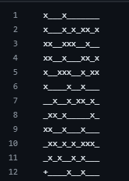

# PyGame-Maze
Python Maze Game

Takes a text file, parses it into a maze, and then creates a game regarding this maze with the controls changing as the user levels up.

In the process of translating this code from Python to JavaScript, to turn it into a browser extension.

## Visuals

> 

## Parsing

